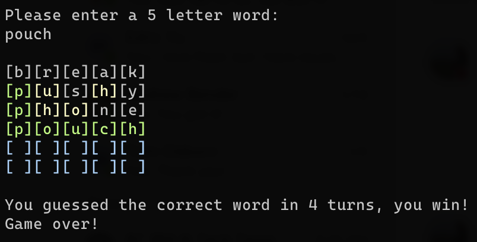

# Wordle.rs

Welcome to Wordle.rs! This is a command line port of the game [Wordle](https://www.powerlanguage.co.uk/wordle/) in Rust. I built this in order to get more familiar with programming in Rust.

## Features

- Totally command line based
- Different word everytime you play
- Color highlighted cells

  - Blue for empty
  - White for incorrect letter
  - Yellow for correct letter, but incorrect placement
  - Green for correct letter and placement

### Things Still to Add/Fix

- [x] Add validation on if a guess is an actual word or a bunch of random letters
- [ ] Let users choose number of guesses and/or word length
- [x] Cleanup main game logic
- [x] Handle upper vs lower case
- [ ] Handle any weird character input
- [ ] Scores/streaks for players
- [ ] Display incorrect letter guesses

## Setup

To run Wordle.rs, the first thing you'll want to do is clone the repository and run `cargo build` to install the necessary dependencies. Then, you can use `cargo run` or `./target/debug/wordle_rs` to play!

*Note: you do need to have the Rust compiler installed to run this*

---

### Support

If you think this project is neat and wanna see more, feel free to drop a follow on Twitter or GitHub. You can also buy me a coffee if you're feeling like fueling my coding/caffeine addiction!

